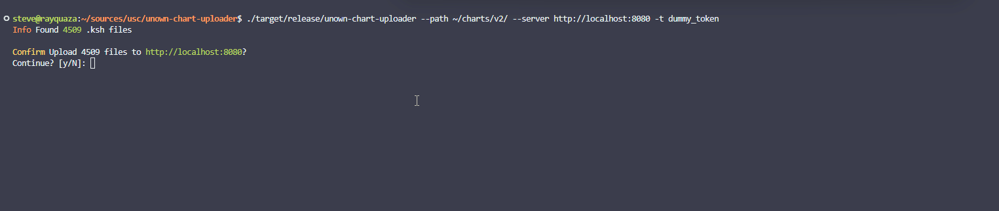

# unown-chart-uploader

A command-line tool for bulk uploading KSH chart files to my USC IR Server known as Unown IR Server. This tool simplifies the process of uploading multiple charts, handling retries, and providing detailed feedback on the upload status.

## Server Compatibility

This tool is designed to work with the Unown IR server, it's really dependent on how I structured my server API for ingesting chart data. If you want to use your own implementation of the USC-IR Server, I can help you modify the code to work with your server.

### Basic Usage

```bash
unown-chart-uploader -p ./charts -s http://localhost:8080 -t YOUR_TOKEN
```



### Command-Line Arguments

| Argument    | Short | Long                  | Description                                   | Required |
| ----------- | ----- | --------------------- | --------------------------------------------- | -------- |
| Path        | `-p`  | `--path`              | Path to the charts directory                  | Yes      |
| Server      | `-s`  | `--server`            | Server URL (e.g., http://localhost:8080)      | Yes      |
| Token       | `-t`  | `--token`             | Authorization token                           | Yes      |
| Dry Run     | `-d`  | `--dry-run`           | Show what would be uploaded without uploading | No       |
| Yes         | `-y`  | `--yes`               | Skip confirmation prompt                      | No       |
| Continue    | `-c`  | `--continue-on-error` | Continue on upload errors                     | No       |
| Verbose     | `-v`  | `--verbose`           | Show detailed information                     | No       |
| Max Retries | `-r`  | `--max-retries`       | Maximum retry attempts (default: 3)           | No       |
| Retry Delay |       | `--retry-delay`       | Delay between retries in seconds (default: 1) | No       |

### Examples

#### Dry Run

Preview what files will be uploaded without actually uploading them:

```bash
unown-chart-uploader -p ./charts -s http://localhost:8080 -t YOUR_TOKEN --dry-run
```

#### Verbose Upload with Auto-Confirm

Upload with detailed output and skip confirmation:

```bash
unown-chart-uploader -p ./charts -s http://localhost:8080 -t YOUR_TOKEN -v -y
```

#### Continue on Errors with Retries

Upload all files, continuing even if some fail, with 5 retry attempts:

```bash
unown-chart-uploader -p ./charts -s http://localhost:8080 -t YOUR_TOKEN -c -r 5
```

## Expected Folder Structure

The tool expects a folder structure similar to:

```
charts/
├── SDVX_BOOTH/
│   ├── 59_idearhythm/
│   │   ├── adv.ksh
│   │   ├── exh.ksh
│   │   └── nov.ksh
│   └── aa_blacky/
│       ├── adv.ksh
│       ├── exh.ksh
│       └── inf.ksh
└── SDVX_II/
    └── some_song/
        └── chart.ksh
```

## Contributing

Contributions are welcome! 

Please open an issue for discussion and I can provide guidance on how to contribute.
